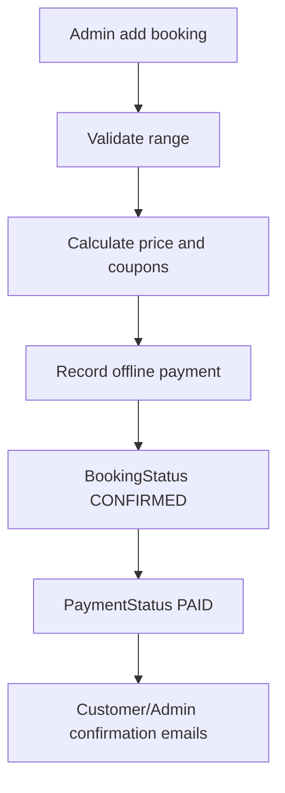
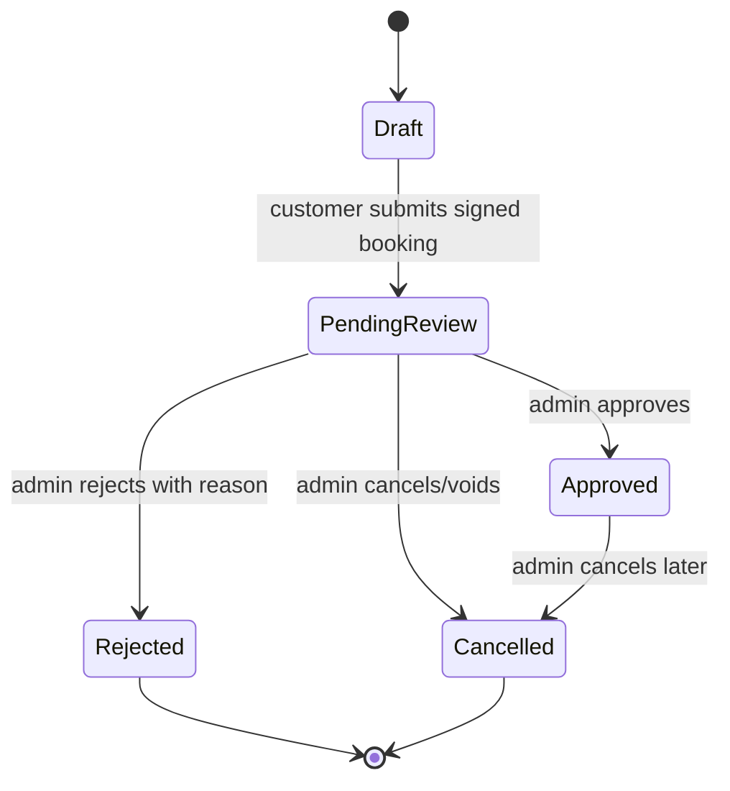
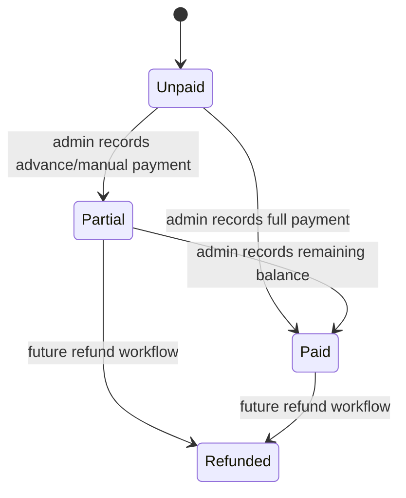

# Haven Retreat Booking Workflow Refactor

Status: implementation planning only. Do not begin production code changes until this document is reviewed and accepted.

## Objective

Move the public booking journey from payment-first confirmation to admin-reviewed booking submission:

```text
Current:
Package -> Schedule -> Contact -> Occasion -> Extras -> Agreement -> Payment -> Confirmed

Target:
Package -> Schedule -> Contact -> Occasion -> Extras -> Agreement -> Submit Booking -> Pending Review
```

Admin then decides:

```text
Pending Review -> Approve -> Approved
Pending Review -> Reject with required reason -> Rejected
Pending Review -> Cancel -> Cancelled
```

No customer payment is collected during public booking. Square and payment code must remain in the project, disabled and ready for future provider work. Booking lifecycle and payment lifecycle must stay independent.

## Source Context

Read first:

- `README.md`
- `docs/booking-ui-refactor.md`
- `docs/booking-hero-polish.md`
- This document

Note: the requested "Sandy Toes implementation analysis" was not present in this repository under that name. The architecture adopted here is the approval-workflow direction from the refactor brief, adapted to Haven Retreat's current schema, admin booking flow, pricing, coupons, locks, agreements, email, and Square integration.

## 1. Current Architecture

The current public booking flow creates a real `Booking` early, holds a time range, gathers customer details, stores agreement acceptance, then sends the customer to Square.

```mermaid
flowchart TD
  A[Package] --> B[Schedule]
  B --> C[Create or update Booking with INCOMPLETE hold]
  C --> D[Contact]
  D --> E{Decoration required?}
  E -- yes --> F[Occasion]
  F --> G[Extras]
  E -- no --> H[Agreement]
  G --> H[Agreement]
  H --> I[POST /api/bookings/accept-terms]
  I --> J[BookingStatus AWAITING_PAYMENT]
  J --> K[/booking/payment]
  K --> L[POST /api/payments/square/create-checkout]
  L --> M[Square hosted checkout]
  M --> N[Square return or webhook]
  N --> O[finalizeRangePayment]
  O --> P[BookingStatus CONFIRMED + PaymentStatus PAID]
  P --> Q[/booking/success]
```

Important current files:

- Public flow pages:
  - `src/app/booking/package/page.tsx`
  - `src/app/booking/schedule/page.tsx`
  - `src/app/booking/contact/page.tsx`
  - `src/app/booking/occasion/page.tsx`
  - `src/app/booking/extras/[category]/page.tsx`
  - `src/app/booking/agreement/page.tsx`
  - `src/app/booking/payment/page.tsx`
  - `src/app/booking/success/page.tsx`
- Public APIs:
  - `src/app/api/bookings/current/route.ts`
  - `src/app/api/bookings/update/contact/route.ts`
  - `src/app/api/bookings/update/occasion/route.ts`
  - `src/app/api/bookings/items/route.ts`
  - `src/app/api/bookings/items/commit/route.ts`
  - `src/app/api/bookings/apply-coupon/route.ts`
  - `src/app/api/bookings/remove-coupon/route.ts`
  - `src/app/api/bookings/accept-terms/route.ts`
  - `src/app/api/bookings/prepare-payment/route.ts`
  - `src/app/api/payments/square/create-checkout/route.ts`
  - `src/app/api/payments/square/status/route.ts`
  - `src/app/api/payments/square/webhook/route.ts`
- Core services:
  - `src/services/booking/range-booking-session.service.ts`
  - `src/services/booking/range-payment.service.ts`
  - `src/services/booking/square-payment-finalizer.service.ts`
  - `src/services/booking/booking-lock-lifecycle.service.ts`
  - `src/services/booking/booking-confirmation-email.service.ts`
  - `src/services/booking/admin-booking-confirmation-email.service.ts`
  - `src/services/booking/booking-payment-link-email.service.ts`
- Schema:
  - `Booking.bookingStatus`
  - `Booking.paymentStatus`
  - `Booking.holdExpiresAt`
  - `Booking.lockVersion`
  - `Payment`
  - `SignedAgreement`
  - `CouponUsage`

Current booking statuses:

```prisma
enum BookingStatus {
  INCOMPLETE
  AWAITING_PAYMENT
  PAYMENT_PROCESSING
  CONFIRMED
  CANCELLED
  ABANDONED
  PAID_EXPIRED
}
```

Current payment statuses:

```prisma
enum PaymentStatus {
  INITIALIZED
  AWAITING_PAYMENT
  PAID
  MANUAL_REVIEW
  FAILED
  CANCELLED
  EXPIRED
  OFFLINE
}
```

Current admin flow:



The admin flow already supports offline/manual collection and must remain stable.

## 2. New Architecture

The public agreement step becomes the submission step. It signs the agreement, validates the active hold, marks the booking as pending review, and sends the customer to a pending-review success screen. It does not create a payment attempt.

```mermaid
flowchart TD
  A[Package] --> B[Schedule]
  B --> C[Booking INCOMPLETE with active hold]
  C --> D[Contact]
  D --> E{Decoration required?}
  E -- yes --> F[Occasion]
  F --> G[Extras]
  E -- no --> H[Agreement]
  G --> H[Agreement]
  H --> I[Submit Booking]
  I --> J[POST /api/bookings/submit]
  J --> K[BookingStatus PENDING_REVIEW]
  K --> L[PaymentStatus UNPAID]
  L --> M[/booking/success?t=...]
  M --> N[Pending review experience]
```

Admin approval:



Payment lifecycle remains separate:



Key design choices:

- Public booking submission does not call Square.
- `Payment` records are optional and only created when payment is actually recorded.
- Public bookings enter `PENDING_REVIEW` with `UNPAID`.
- Admin-created bookings may still be created as `APPROVED`/`CONFIRMED` with manual payment according to current admin behavior.
- Existing Square routes remain in place behind feature flags.
- Future payment providers should plug into the existing payment layer without changing the booking approval workflow.

## 3. Business Rules

These rules define the scope of this refactor:

- Public booking never creates a payment.
- Public booking never redirects to Square checkout.
- Public booking always becomes `PENDING_REVIEW` after successful submission.
- Approval never records payment.
- Recording payment never approves booking.
- Reject reason is mandatory.
- Existing admin manual booking creation must continue working.
- Existing admin manual payment recording must continue working.
- Booking status and payment status remain independent.
- Square remains in the codebase but disabled for the public booking flow.
- Do not delete Square code, payment routes, or payment services that may be reused later.
- Future payment providers such as Square, Zelle, and payment links should not require booking workflow changes.
- Future activity logging can be introduced later if operational auditing becomes necessary.
- All review actions require authenticated admin access. Future role-based permissions can be added later.

### Admin Booking Protection

> Do not modify any existing admin booking functionality unless it is directly required for the new review workflow.
>
> Existing admin booking creation, pricing, coupon handling, manual payment recording, advance payment, full payment, and offline payment behavior must remain unchanged.
>
> This refactor only changes the **public booking workflow** and introduces the **admin review workflow**. Any unrelated admin functionality should be treated as a regression risk and left untouched.

> When implementation requires changes to shared services or components, prefer additive changes over rewrites to preserve existing admin functionality.

## 4. Database Changes

### BookingStatus

Do not force unnecessary internal enum renames. Internal status names should change only when they provide real business value or remove genuine ambiguity. The UI can show customer/admin-friendly labels without requiring every persisted enum value to be renamed.

For example, existing `INCOMPLETE` can continue representing an in-progress booking session. The UI may display that as "Draft" or "In progress", but internally it is already understood by the current lock/session code.

Clearly separate these three concepts:

| Concept | Meaning | Example |
| --- | --- | --- |
| Internal status | Persisted enum used by code and migrations | `INCOMPLETE` |
| Display label | UI copy shown to customer/admin | `Draft` |
| Business meaning | Operational interpretation | Temporary booking session before submission |

Recommended approach:

- Preserve existing statuses where they still fit the business meaning.
- Add only the new statuses required for the approval workflow.
- Keep legacy statuses readable for backward compatibility.
- Avoid data migrations whose only purpose is cosmetic naming.

Minimum booking statuses for this refactor:

```prisma
enum BookingStatus {
  INCOMPLETE
  PENDING_REVIEW
  APPROVED
  REJECTED
  CANCELLED

  // Existing legacy/current compatibility
  AWAITING_PAYMENT
  PAYMENT_PROCESSING
  CONFIRMED
  ABANDONED
  PAID_EXPIRED
}
```

Additional lifecycle states can be introduced later if business requirements change. Do not add speculative future statuses in this refactor.

Internal/display/business mapping:

| Internal status | Display label | Business meaning | Status type |
| --- | --- | --- | --- |
| `INCOMPLETE` | Draft / In progress | Active public booking before submit; current lock/session behavior | Implemented now |
| `PENDING_REVIEW` | Pending Review | Customer submitted signed booking; admin decision required | Implement in this refactor |
| `APPROVED` | Approved | Admin accepted request | Implement in this refactor |
| `REJECTED` | Rejected | Admin rejected request with reason | Implement in this refactor |
| `CANCELLED` | Cancelled | Booking cancelled/voided | Implemented now |
| `AWAITING_PAYMENT` | Awaiting Payment | Legacy/future payment collection state | Legacy compatibility |
| `PAYMENT_PROCESSING` | Payment Processing | Legacy Square checkout in progress | Legacy compatibility |
| `CONFIRMED` | Confirmed / Approved | Existing confirmed booking | Legacy compatibility |
| `ABANDONED` | Abandoned | Expired or abandoned booking session | Legacy compatibility |
| `PAID_EXPIRED` | Payment Incident | Payment captured after booking expiry | Legacy compatibility |

Implementation note: Prisma/PostgreSQL enum migrations require care. Add new enum values first. Do not remove old values in the first phase.

### PaymentStatus

Use the same preservation rule for payment statuses: do not rename or expand enums purely for display copy. The current `PaymentStatus` values mix booking-level summary states and provider-attempt states, so the refactor should use small display helpers first and only add enum values when implementation needs them.

Current enum:

```prisma
enum PaymentStatus {
  INITIALIZED
  AWAITING_PAYMENT
  PAID
  MANUAL_REVIEW
  FAILED
  CANCELLED
  EXPIRED
  OFFLINE
}
```

Recommended display labels:

| Internal status / derived condition | Display label | Business meaning | Status type |
| --- | --- | --- | --- |
| `INITIALIZED` with no payment rows | Unpaid | No payment has been collected | Implemented now via display helper |
| `advancePaid > 0` and `remainingPayable > 0` | Partial | Some money collected, balance remains | Implemented now via display helper |
| `PAID` or `remainingPayable <= 0` | Paid | Full amount collected | Implemented now |
| Future refund rows | Refunded | Money returned after payment | Future reserved |
| `AWAITING_PAYMENT` | Awaiting Payment | Provider/payment link waiting for customer | Legacy/future provider-attempt |
| `MANUAL_REVIEW` | Manual Review | Payment incident needs admin review | Legacy compatibility |
| `FAILED` | Failed | Provider attempt failed | Legacy provider-attempt |
| `CANCELLED` | Cancelled | Provider attempt cancelled | Legacy provider-attempt |
| `EXPIRED` | Expired | Provider attempt/session expired | Legacy provider-attempt |
| `OFFLINE` | Offline Recorded | Legacy/manual collection marker | Legacy compatibility |

No `PaymentStatus` enum change is required for the core refactor unless implementation discovers a concrete need.

Mapping guidance:

| Current | Target | Notes |
| --- | --- | --- |
| `INITIALIZED` | `UNPAID` | No payment attempt exists. |
| `AWAITING_PAYMENT` | legacy provider-attempt | Do not use for booking-level payment lifecycle. |
| `PAID` | `PAID` | Keep. |
| `OFFLINE` | `PARTIAL` or `PAID` | Based on amount collected. |
| `MANUAL_REVIEW` | legacy incident | Payment incident status, not booking lifecycle. |
| `FAILED` | legacy attempt | Belongs to `Payment`, not booking summary. |
| `CANCELLED` | legacy attempt | Belongs to `Payment`. |
| `EXPIRED` | legacy attempt | Belongs to `Payment`. |

Keep the current enum and introduce helpers that display `INITIALIZED` as `UNPAID` and calculate partial/paid from `advancePaid`, `remainingPayable`, and latest `Payment`.

### New Booking Fields

Add fields to support review decisions without overloading cancellation fields:

```prisma
reviewSubmittedAt DateTime?
reviewedAt        DateTime?
reviewedByAdminId String?
rejectionReason   String?
approvalNotes     String?
internalNotes     String?
```

Recommended indexes:

```prisma
@@index([bookingStatus, reviewSubmittedAt])
@@index([reviewedByAdminId, reviewedAt])
```

Do not reuse `cancelledReason` for rejection. Rejection is a review decision; cancellation is an operational lifecycle event.

### Future Payment Compatibility

The existing `Payment` model is a good foundation because it already has:

- `provider`
- `transactionId`
- `providerOrderId`
- `providerPaymentId`
- `idempotencyKey`
- `providerPayload`
- `method`
- `recordedByAdminId`
- `amount`
- `status`

Future improvement, not required in this phase:

```prisma
enum PaymentProvider {
  SQUARE
  ZELLE
  CASH
  BANK_TRANSFER
  MANUAL
  PAYMENT_LINK
}
```

Keep `provider` as `String` for now unless the implementation team wants a strict enum. String is more flexible for staged provider rollout.

### Migration Strategy

Phase migration should be additive:

1. Add only necessary new enum values: `PENDING_REVIEW`, `APPROVED`, `REJECTED`.
2. Add review fields.
3. Backfill current records:
   - `CONFIRMED` remains readable as approved. Do not migrate it only for naming.
   - `INCOMPLETE` active holds can remain as legacy drafts until expiry.
   - `AWAITING_PAYMENT` records with signed agreement and no Square attempt should become `PENDING_REVIEW`.
   - `PAYMENT_PROCESSING` with active Square attempts should remain legacy until resolved.
4. Update application code to write new statuses.
5. Update admin filters and UI to read both new and legacy statuses during rollout.
6. Later cleanup: remove unused enum values only after production data has no rows using them and payment incident routes are safely archived.

## 5. Booking Lifecycle

### Statuses

| Internal status | Display label | Meaning | Created by | Editable? |
| --- | --- | --- | --- | --- |
| `INCOMPLETE` | Draft / In progress | Temporary public booking with held range | Public flow | Yes, while hold active |
| `PENDING_REVIEW` | Pending Review | Customer submitted signed booking; admin must approve/reject | Public submit | Admin editable only |
| `APPROVED` | Approved | Admin accepted booking request | Admin approval | Admin editable with guardrails |
| `REJECTED` | Rejected | Admin rejected request with required reason | Admin rejection | No, except notes/resubmission later if added |
| `CANCELLED` | Cancelled | Booking cancelled/voided | Admin/system | No standard edit |

Legacy compatibility:

- Treat `INCOMPLETE` as the in-progress/draft display state.
- Treat `CONFIRMED` like `APPROVED`.
- Treat `ABANDONED` as expired draft/legacy abandoned.
- Treat `PAID_EXPIRED` as payment incident/legacy.

Additional lifecycle states can be introduced later if business requirements change. They are outside this refactor.

### Transitions

| From | To | Trigger | Validation |
| --- | --- | --- | --- |
| none | `INCOMPLETE` | Schedule/package starts booking | Package active, range available, hold created |
| `INCOMPLETE` | `INCOMPLETE` | Contact/occasion/extras edits | Active session and lock version |
| `INCOMPLETE` | `PENDING_REVIEW` | Customer submits signed agreement | Active hold, required contact, schedule, package, agreement clauses/signature, no range conflict |
| `PENDING_REVIEW` | `APPROVED` | Admin approve | No approved booking conflict, required agreement present |
| `PENDING_REVIEW` | `REJECTED` | Admin reject | Reason required |
| `PENDING_REVIEW` | `CANCELLED` | Admin cancel/void | Reason recommended |
| `APPROVED` | `CANCELLED` | Admin cancellation | Reason required/recommended |

### Hold Behavior

Current code uses `holdExpiresAt`, `lockVersion`, and `ACTIVE_RANGE_HOLD_STATUSES` for temporary reservation. The refactor must decide how long a pending review blocks a time range.

Recommended behavior:

- `INCOMPLETE`: hold expires as today.
- `PENDING_REVIEW`: range remains reserved from customer perspective and blocks overlapping public bookings until admin rejects/cancels or a configured review SLA expires.
- `APPROVED`: range blocks bookings permanently unless cancelled.
- `REJECTED`/`CANCELLED`: range released.

Update conflict queries to consider:

```text
blocking statuses = PENDING_REVIEW + APPROVED + legacy CONFIRMED + active INCOMPLETE holds
```

Do not leave `PENDING_REVIEW` dependent on `holdExpiresAt` unless the business wants pending requests to auto-expire. If auto-expiry is desired, add a specific `reviewExpiresAt` instead of overloading `holdExpiresAt`.

## 6. Payment Lifecycle

### Current

Public payment is Square-first:

```text
accept terms -> AWAITING_PAYMENT/INITIALIZED
create checkout -> PAYMENT_PROCESSING/AWAITING_PAYMENT
Square finalize -> CONFIRMED/PAID
```

Admin payment is already offline/manual:

```text
admin create/edit -> OFFLINE Payment row -> booking advancePaid/remainingPayable updated
```

### Target

Public booking:

```text
submit booking -> PENDING_REVIEW/UNPAID
```

Admin payment:

```text
record no payment -> UNPAID
record advance -> PARTIAL
record full -> PAID
future refund -> REFUNDED
```

Payment lifecycle must be computed or stored independently from booking approval:

- A booking can be `APPROVED` and `UNPAID`.
- A booking can be `PENDING_REVIEW` and `UNPAID`.
- A booking can be `APPROVED` and `PARTIAL`.
- A booking can be `CANCELLED` and `REFUNDED`.

### Why Approval and Payment Stay Independent

Approval answers: "Does Haven Retreat accept this event request?"

Payment answers: "How much money has been collected, by which method, and what balance remains?"

Those questions change at different times and may be handled by different people. Keeping them independent avoids future refactors when payment methods expand.

Examples this architecture must support:

- `APPROVED` + `UNPAID`: admin approved the event, payment will be collected later.
- `APPROVED` + `PARTIAL`: admin recorded a cash/Zelle/bank advance.
- `APPROVED` + `PAID`: admin recorded full payment.
- `PENDING_REVIEW` + `UNPAID`: customer submitted a request; no payment has been requested.
- Future `APPROVED` + Square payment link pending: booking approval is complete, payment request is separate.
- Future `APPROVED` + Zelle payment recorded: offline provider is a payment detail, not a booking status.
- Future `APPROVED` + payment link sent: the link belongs to payment workflow, not approval workflow.

This separation means future Square, Zelle, cash, bank transfer, manual payment, and payment-link flows can be added as payment actions without rewriting booking approval, admin review, conflict checks, or customer submission.

### Not Implemented Now

Do not implement:

- Square public payment collection
- Zelle payment flow
- Cash collection flow beyond existing admin manual recording
- Bank transfer reconciliation
- Payment links
- Payment reminders
- Refund workflow

### Architecture Notes

Do not introduce new payment architecture unless implementation proves it is required. The existing payment architecture is sufficient for this refactor.

For this phase:

- Booking approval is independent from payment.
- Existing admin manual payment workflow remains unchanged.
- Existing `Payment` rows and payment fields remain the source for manual payment display.
- Future payment providers should plug into the existing payment layer without changing public booking submission or admin review transitions.

Square remains:

- `src/lib/square/server.ts`
- `src/app/api/payments/square/*`
- `src/services/booking/range-payment.service.ts`
- `src/services/booking/square-payment-finalizer.service.ts`

But public routes should not call it while payments are disabled.

## 7. API Changes

### Public Booking APIs

| API | Current behavior | New behavior | Breaking change |
| --- | --- | --- | --- |
| `GET /api/bookings/current` | Returns active booking/session | Return draft or submitted booking as needed | Add new status names |
| `POST /api/bookings/update/contact` | Updates contact and pricing | Same | Validate not submitted |
| `POST /api/bookings/update/occasion` | Updates occasion | Same | Validate not submitted |
| `GET/POST /api/bookings/items` | Reads/modifies items | Same | Validate not submitted |
| `POST /api/bookings/items/commit` | Commits extras | Same | Validate not submitted |
| `POST /api/bookings/apply-coupon` | Reserves coupon | Same until submit | On submit, coupon may remain reserved or become confirmed-by-review depending business choice |
| `POST /api/bookings/remove-coupon` | Releases coupon | Same | Validate not submitted |
| `POST /api/bookings/accept-terms` | Signs agreement and sets `AWAITING_PAYMENT` | Either rename behavior to agreement-only or replace with submit API | Yes: no payment status initialization |
| New `POST /api/bookings/submit` | N/A | Signs/stores agreement, validates final booking, sets `PENDING_REVIEW`, returns success token | New endpoint |
| `POST /api/bookings/prepare-payment` | Prepares payment metadata | Disabled for public booking | Return 404/410/feature disabled unless future flag enabled |
| `POST /api/payments/square/create-checkout` | Creates Square checkout | Disabled by feature flags | Public UI must stop calling |
| `GET /api/payments/square/status` | Checks Square payment | Legacy only | No public dependency |
| `POST /api/payments/square/webhook` | Finalizes Square payment | Keep for legacy/future | No public dependency |

Recommended: create `POST /api/bookings/submit` instead of mutating `accept-terms` into a multipurpose endpoint. Keep `accept-terms` as an internal helper or legacy alias only if needed.

### Admin APIs

| API | Current behavior | New behavior |
| --- | --- | --- |
| `GET /api/admin/bookings` | Tabs active/live/abandoned; main tab mostly `CONFIRMED` | Add pending review filter/tab and include `PENDING_REVIEW` |
| `GET /api/admin/bookings/[id]?view=drawer` | Drawer details | Include review fields and rejection reason |
| `PATCH /api/admin/bookings/[id]` | Edit booking and manual payment | Preserve; allow edits for `PENDING_REVIEW` and `APPROVED`, block `REJECTED`/`CANCELLED` |
| `DELETE /api/admin/bookings/[id]` if present | Soft delete/cancel | Preserve; avoid conflating with reject |
| New `POST /api/admin/bookings/[id]/approve` | N/A | Approves pending booking, sends emails |
| New `POST /api/admin/bookings/[id]/reject` | N/A | Rejects pending booking, requires reason, sends email |
| `POST /api/admin/bookings/create` | Creates offline/manual confirmed booking | Preserve; optionally write `APPROVED` instead of `CONFIRMED` |
| `POST /api/admin/bookings/coupon-preview` | Coupon preview | Preserve |
| `GET /api/admin/payments` | Payment log | Preserve; update labels for unpaid/partial/paid |

### Compatibility

API responses should include both raw and display values during migration:

```ts
bookingStatus: "PENDING_REVIEW",
bookingStatusLabel: "Pending Review",
paymentStatus: "UNPAID",
paymentStatusLabel: "Unpaid"
```

## 8. Frontend Changes

### Booking Flow

Remove the customer-facing payment step from active navigation.

New active progression:

```text
Package -> Schedule -> Contact -> Occasion -> Extras -> Agreement -> Pending Review
```

Without decoration:

```text
Package -> Schedule -> Contact -> Agreement -> Pending Review
```

Update:

- `BOOKING_ROUTES` to include submit/review language if needed.
- `StepIndicator` labels:
  - Replace `Payment` with `Review` or `Submit`.
  - Final state should read `Pending Review`, not `Confirmed`.
- Agreement CTA:
  - Current: payment-oriented continue.
  - New: `Submit Booking Request`.
- Payment page:
  - Remove from automatic journey.
  - Keep route disabled/legacy guarded with a clear message if visited directly.
- Success page:
  - Show pending review state.
  - Do not show paid/deposit language unless an admin payment exists.

### Agreement Page

Change the final action from payment handoff to submission:

- Button: `Submit Booking Request`
- Helper text: "No payment is due now. Haven Retreat will review your event details and contact you with the next step."
- Loading state: `Submitting booking...`
- Success redirect: `/booking/success?t=...`
- Error state: preserve existing session expired and conflict handling.

### Success Page

Current copy already has useful review language in `src/constants/booking-status-copy.ts`. Update it to be explicitly no-payment:

- Title: `Booking request received`
- Message: `Your date is reserved for review. Haven Retreat will confirm availability and next steps shortly.`
- Payment card:
  - `Payment due now: $0`
  - `Payment status: Unpaid`
  - `Next step: Admin review`
- Hide or relabel PDF ticket if it currently implies confirmation. Use "Booking request summary" until approved.

### Admin

Add pending review as a first-class operational state:

- Bookings page tab/filter: `Pending Review`
- Drawer action bar:
  - `Approve`
  - `Reject`
  - `Edit details`
  - `Record payment` if approved or if business allows before approval
- Status badges:
  - `Pending Review`: amber
  - `Approved`: emerald
  - `Rejected`: rose
  - `Cancelled`: slate/rose
  - `Unpaid`: neutral
  - `Partial`: amber/blue
  - `Paid`: emerald
  - `Refunded`: slate
- Sidebar:
  - Optional count badge for pending review.
  - Do not create a whole new section unless volume warrants it.
- Future review page:
  - Can be a filtered `/admin/bookings?status=PENDING_REVIEW`.
  - Avoid duplicating list infrastructure.

## 9. Admin Workflow

### Pending List

Pending list should prioritize:

- Event date and time
- Customer name/phone/email
- Package
- Guest count
- Decoration required
- Total estimate
- Agreement signed indicator
- Submitted age/SLA

### Approve

Approval action:

1. Lock booking row.
2. Validate current status is `PENDING_REVIEW`.
3. Re-check overlapping bookings against `PENDING_REVIEW`, `APPROVED`, and legacy `CONFIRMED`, excluding the current booking.
4. Confirm products are still available if products use stock.
5. Decrement stock only on approval if not already decremented earlier.
6. Set:
   - `bookingStatus = APPROVED`
   - `reviewedAt = now`
   - `reviewedByAdminId = adminId`
   - `approvalNotes` optional
7. Send approval emails.
8. Keep `paymentStatus` unchanged unless payment is recorded separately.

### Reject

Reject action:

1. Require reason before request is sent.
2. Lock booking row.
3. Validate current status is `PENDING_REVIEW`.
4. Set:
   - `bookingStatus = REJECTED`
   - `reviewedAt = now`
   - `reviewedByAdminId = adminId`
   - `rejectionReason = reason`
5. Release coupon reservations and range hold.
6. Send rejection email.

### Reason Popup

Use existing admin modal/drawer style:

- Title: `Reject booking request`
- Textarea label: `Reason`
- Required helper text: "This reason may be shared with the customer. Keep it clear and professional."
- Primary destructive action: `Reject request`
- Secondary action: `Keep pending`
- Disabled state until reason has content.

### Internal Notes

Use `internalNotes` for admin-only operational notes. Do not mix with customer-visible rejection reason.

### Future Payment Actions

Payment actions should live in a payment section:

- `Record payment`
- `Send payment link` future
- `Mark as unpaid` only with guardrails
- `Refund` future

Do not approve by recording payment. Do not record payment by approving.

### Admin Access

All review actions require authenticated admin access. Future role-based permissions can be added later if the admin team needs separate staff permissions.

### Future Activity Logging

Future activity logging can be introduced later if operational auditing becomes necessary. Do not add audit tables or timeline models in this refactor.

## 10. Email Workflow

### Booking Submitted

Trigger: customer submit.

Customer email:

- Subject: `Booking request received - {bookingRef}`
- State: pending review
- Include summary, date/time, package, guest count, agreement reference.
- No payment request.

Admin email:

- Subject: `New booking request pending review - {bookingRef}`
- Include review link, customer details, schedule, package, total estimate, signed agreement indicator.

### Booking Approved

Trigger: admin approve.

Customer email:

- Subject: `Booking approved - {bookingRef}`
- Include next steps and payment instructions only if configured.
- For this phase, keep payment instructions neutral: "Haven Retreat will contact you with payment options."

Admin email:

- Optional audit notification or skip if action is already in admin UI.

### Booking Rejected

Trigger: admin reject.

Customer email:

- Subject: `Booking request update - {bookingRef}`
- Include polite rejection reason.
- Offer contact path.

Admin email:

- Optional, probably not needed.

### Future Payment Email

Not implemented now. Keep existing `BookingPaymentLinkEmail` for future payment links, disabled.

### Future Reminder Email

Not implemented now. Architecture should allow reminders based on:

- `bookingStatus = APPROVED`
- `paymentStatus in (UNPAID, PARTIAL)`
- Event date proximity

### Email Architecture Note

Synchronous email sending is acceptable today. Email delivery should remain abstracted so it can be moved to queued delivery in the future without changing booking logic.

## 11. UX Improvements

Keep Haven Retreat's existing quiet, polished booking design. Improvements should reduce anxiety around "no payment now":

- Replace payment urgency with review clarity.
- Show a "No payment due today" reassurance on agreement and pending-review success.
- Make pending review feel intentional, not incomplete.
- Give admin a focused pending review list with clear approve/reject actions.
- Use status labels that match business language.
- Show signed agreement status in admin before approval.
- Add submitted age/SLA microcopy to admin pending rows.

### Customer Timeline

The customer success experience should evolve from a single "Pending Review" message into a simple progress timeline.

Future timeline:

```text
✓ Booking Submitted
○ Under Review
○ Approved
○ Payment
○ Event Day
```

Implemented in this refactor:

- `Booking Submitted`
- `Under Review`

Future/reserved:

- `Approved`
- `Payment`
- `Event Day`

Timeline behavior:

- Submitted state should feel complete, not abandoned.
- Under Review should explain that no payment is due now.
- Approved should appear after admin approval.
- Payment should appear only when payment collection is enabled or manually recorded.
- Event Day should be future customer-experience polish, not part of this refactor.

## 12. UI Guidelines

This section is the UI implementation guideline for the refactor and future booking workflow work.

Follow existing design language:

- Tailwind utility style already used in booking/admin components.
- Reuse existing components first.
- Avoid duplicate components when an existing component can be extended cleanly.
- Teal brand actions (`#347f7c`) for primary non-destructive actions.
- Amber for pending/review.
- Emerald for approved/paid.
- Rose for rejected/cancelled/destructive.
- Neutral slate for unpaid/draft.
- Existing spacing scale.
- Existing typography scale.
- Existing colors.
- Existing button styles.
- Existing card styles.
- Existing button heights, borders, shadows, and compact admin filters.
- Cards should remain 8px radius or less unless matching existing components.
- Use existing icons before adding new icon systems.
- Preserve loading, disabled, hover, and focus states.
- Maintain accessible labels, focus states, contrast, keyboard behavior, and dialog semantics.
- Keep loading states consistent across submit, approve, reject, payment record, and email actions.
- Keep disabled states consistent and explain why an action is unavailable when helpful.
- No landing page, no broad redesign, no ornamental backgrounds.

## 13. Micro UX

Use only where useful:

- Agreement helper card: "No payment is required to submit."
- Submit loading toast/message: "Submitting booking request..."
- Success state: clear pending review timeline.
- Admin pending empty state: "No booking requests waiting for review."
- Reject modal required reason validation.
- Approve confirmation if event is soon or has conflict risk.
- Tooltip on payment status: "Payment is tracked separately from approval."
- Warning when approving if payment is unpaid: "Approval does not record payment."
- Error if duplicate submit: return existing pending review success token.
- Error if range conflict appears during submit/approve: ask customer/admin to choose a different range.

## 14. Components

### New Components

| Component | Folder | Responsibility |
| --- | --- | --- |
| `ReviewStatusCard` | `src/components/booking/success/` | Public pending/approved/rejected state summary |
| `SubmitBookingPanel` or update existing agreement action | `src/components/booking/agreement/` | Final submit CTA and no-payment helper |
| `ReviewDecisionModal` | `src/components/admin/bookings/drawer/` | Approve/reject confirmation and reason textarea |
| `PaymentLifecycleBadge` | `src/components/admin/bookings/` or shared admin | Display unpaid/partial/paid independently |
| `ReviewSlaBadge` | `src/components/admin/bookings/` | Submitted age indicator |

### Modified Components

- `src/components/booking/agreement/BookingAgreementStep.tsx`
  - Submit booking instead of routing to payment.
- `src/components/booking/steps/StepIndicator.tsx`
  - Remove payment step from active customer flow.
- `src/app/booking/payment/page.tsx`
  - Disable/legacy guard.
- `src/app/booking/success/BookingSuccessClient.tsx`
  - Render pending review and approved states.
- `src/components/booking/success/*`
  - Remove deposit/paid assumptions from active customer request state.
- `src/components/admin/bookings/BookingStatusPill.tsx`
  - Add new statuses and legacy aliases.
- `src/components/admin/bookings/BookingFilters.tsx`
  - Add pending/approved/rejected options.
- `src/components/admin/bookings/BookingRow.tsx`
  - Add review/payment independent displays.
- `src/components/admin/bookings/drawer/BookingDetails.tsx`
  - Add review fields, decision actions, notes.
- `src/components/admin/bookings/add/AdminAddBookingForm.tsx`
  - Preserve manual/offline payment workflow.

### Reusable Components

- Existing `ConfirmActionModal`
- Existing `AdminDrawer`
- Existing `AdminEmptyState`
- Existing compact filters
- Existing toast provider

### Removed Components

None in the first implementation. Disable or route around payment components rather than deleting them.

### Props and Dependencies

Add review fields to admin types:

```ts
reviewSubmittedAt?: string | null;
reviewedAt?: string | null;
reviewedByAdminId?: string | null;
rejectionReason?: string | null;
approvalNotes?: string | null;
internalNotes?: string | null;
paymentStatusLabel?: string;
bookingStatusLabel?: string;
```

Keep existing `BookingStatus`/`PaymentStatus` imports from Prisma after enum migration.

## 15. Services

### Booking Service

Keep current range/session logic and preserve `INCOMPLETE` as the in-progress booking state.

Update `requireActiveRangeBookingSession` so `PENDING_REVIEW` bookings are no longer treated like editable public sessions.

### Approval Service

Create:

```text
src/services/booking/booking-review.service.ts
```

Responsibilities:

- Submit booking for review.
- Approve booking.
- Reject booking.
- Re-check conflicts and stock.
- Release coupons/holds on rejection.
- Write audit/review fields.
- Return stable success token.

### Email Service

Add or adapt:

- `booking-submitted-email.service.ts`
- `booking-approved-email.service.ts`
- `booking-rejected-email.service.ts`

Reuse existing React Email theme/components.

### Payment Layer

Do not introduce a new payment abstraction in this refactor. Use the existing payment model, admin payment routes, and Square-disabled feature flags.

For this phase:

- Do not invoke Square from public booking.
- Do not create public payment records.
- Preserve admin manual payment creation and editing.
- Keep Square code available for future payment work.

## 16. Feature Flags

Existing payment flags:

- `RANGE_PAYMENT_CREATION_ENABLED`
- `SQUARE_RANGE_PAYMENTS_ENABLED`
- `RANGE_PAYMENT_FINALIZATION_ENABLED`

Recommended explicit flags:

```env
PUBLIC_BOOKING_PAYMENTS_ENABLED=false
BOOKING_REVIEW_WORKFLOW_ENABLED=true
SQUARE_PAYMENTS_ENABLED=false
PAYMENT_LINKS_ENABLED=false
```

Rules:

- Public booking must not call Square unless `PUBLIC_BOOKING_PAYMENTS_ENABLED=true`.
- Square webhook may stay enabled for legacy incidents only if needed.
- Admin manual payment stays enabled.
- Feature-disabled routes should return a clear JSON error and not create `Payment` rows.

## 17. Future Compatibility

This architecture supports future payments without another major refactor because booking approval is independent from payment collection.

| Future capability | How it fits |
| --- | --- |
| Square | Re-enable or adapt existing Square payment layer after approval or on admin action |
| Zelle | Record manual/offline payment with provider `ZELLE` and reference |
| Cash | Existing admin offline method |
| Bank Transfer | Existing offline reference pattern; future reconciliation metadata in `providerPayload` |
| Manual Payment | Existing admin payment row creation |
| Payment Link | Future admin action can create a payment request and send email |
| Partial Payments | Existing booking/payment amounts can represent collected amount and balance |
| Multiple Payments | Sum paid/refunded payment rows by booking |
| Offline Payments | Existing `Payment.provider = OFFLINE` pattern |
| Payment Reminders | Query approved bookings where payment remains unpaid/partial |

## 18. Edge Cases

### Customer

- Refresh on agreement page after signing: duplicate submit should be idempotent and return same pending review result.
- Browser back after submit: submitted booking should not become editable without explicit restart.
- Session expires before submit: show session expired modal and release draft.
- Customer opens `/booking/payment`: show disabled/legacy message and route back to success/root.
- Customer uses old payment URL: do not create checkout when disabled.
- Decoration disabled path skips occasion/extras and still submits.
- Coupon applied then booking rejected: release coupon usage.
- Product goes out of stock before submit: block submit or move to admin review warning.
- Product goes out of stock before approve: block approve with clear admin error.

### Admin

- Approve already approved booking: return idempotent success or 409 with current status.
- Reject already approved booking: block; require cancellation flow.
- Reject without reason: 400.
- Pending booking conflicts with another pending booking: allow both pending only if business wants overlapping requests; recommended block at submit/approve based on reserved pending ranges.
- Admin edits pending booking: allowed with conflict validation.
- Admin records payment on pending booking: decide business rule. Recommended allow only with warning that payment does not approve.
- Admin deletes pending booking: use cancel/void, not reject, unless customer-visible reason is required.
- Legacy confirmed booking appears: display as approved.

### API

- Missing booking ID: 400.
- Invalid status transition: 409.
- Lock version mismatch: 409.
- Duplicate submit request: idempotent.
- Square disabled: 503 or 410 with `PAYMENTS_DISABLED`.
- Webhook for old Square payment arrives after refactor: process through legacy path without changing new pending bookings unexpectedly.
- Race between two approvals for overlapping bookings: transaction lock and conflict query must allow only one.

### Concurrency

- Use row lock on booking during submit/approve/reject.
- Use venue/date advisory lock for range conflict checks.
- Conflict checks must include `PENDING_REVIEW`, `APPROVED`, legacy `CONFIRMED`, and active `INCOMPLETE` holds.
- Stock decrement must happen once, preferably on approval.
- Coupon confirmation/release must be transactionally consistent with status changes.

### Validation

- Agreement requires all acknowledged clauses and signature.
- Contact phone/email validation remains.
- Guest count capacity remains.
- Range duration/business hours remain.
- Reject reason length: min 3, max 1000 recommended.
- Internal notes max 2000 recommended.

### Future Payment

- Payment link created for rejected/cancelled booking: block.
- Payment received after cancellation: mark payment incident/manual review.
- Refund after cancellation: future `REFUNDED`.
- Multiple partial payments exceed total: block or cap with admin warning.

## 19. Implementation Phases

### Phase 0: Documentation and Acceptance

Objective:

- Align on architecture before coding.

Files:

- `docs/booking-workflow-refactor.md`

Database:

- None.

Validation:

- Stakeholder review.

### Phase 1: Schema and Status Compatibility

Objective:

- Add review fields and only the required new booking statuses safely.

Files:

- `prisma/schema.prisma`
- New migration under `prisma/migrations/`
- `src/lib/admin-booking-status.ts`
- `src/constants/booking-status-copy.ts`
- Relevant tests.

Database:

- Add `BookingStatus` values: `PENDING_REVIEW`, `APPROVED`, `REJECTED`.
- Do not rename `INCOMPLETE`.
- Do not add speculative future statuses.
- Do not expand `PaymentStatus` unless implementation discovers a concrete need.
- Add review fields.
- Add indexes.
- Optional backfill script/migration.

Validation:

- `npx prisma migrate diff`
- Prisma generate if needed.
- Status display tests.

### Phase 2: Public Submit Flow

Objective:

- Replace payment handoff with submit-for-review.

Files:

- New `src/app/api/bookings/submit/route.ts`
- `src/components/booking/agreement/BookingAgreementStep.tsx`
- `src/app/booking/payment/page.tsx`
- `src/constants/routes.ts`
- `src/components/booking/steps/StepIndicator.tsx`
- `src/services/booking/booking-review.service.ts`

Database:

- Write `PENDING_REVIEW` and `reviewSubmittedAt`.
- Use the chosen payment strategy from Phase 1: derived unpaid display from existing fields, or stored `UNPAID` only if the enum was intentionally expanded.

Validation:

- Submit booking test.
- Duplicate submit test.
- Expired session test.
- No Square route called.

### Phase 3: Pending Review Success UX and Emails

Objective:

- Make submitted booking feel complete and clear.

Files:

- `src/app/booking/success/BookingSuccessClient.tsx`
- `src/components/booking/success/*`
- `src/emails/*`
- `src/services/booking/*email*.service.ts`
- `src/app/api/bookings/by-success-token/route.ts`

Database:

- None beyond reading new fields.

Validation:

- Email render tests.
- Success page data mapping tests.

### Phase 4: Admin Review Actions

Objective:

- Add pending review list/filter, approve, reject, and reason capture.

Files:

- `src/app/api/admin/bookings/route.ts`
- `src/app/api/admin/bookings/[id]/route.ts`
- New `src/app/api/admin/bookings/[id]/approve/route.ts`
- New `src/app/api/admin/bookings/[id]/reject/route.ts`
- `src/components/admin/bookings/*`
- `src/components/admin/bookings/drawer/*`
- `src/types/admin/booking-admin.ts`

Database:

- Write review fields and status transitions.

Validation:

- Admin route tests for approve/reject.
- Conflict race test where possible.
- Reject reason required test.

### Phase 5: Payment Decoupling and Manual Payment Preservation

Objective:

- Ensure admin payment recording works independently from booking approval.

Files:

- `src/app/api/admin/bookings/create/route.ts`
- `src/app/api/admin/bookings/[id]/route.ts`
- `src/app/api/admin/payments/route.ts`
- `src/components/admin/bookings/add/*`

Database:

- Existing `Payment` rows preserved.

Validation:

- Admin manual advance payment test.
- Admin full payment test.
- Approved unpaid booking test.
- Partial payment display test.

### Phase 6: Square Disabled Compatibility

Objective:

- Keep Square in repo but unreachable from public booking unless explicitly enabled.

Files:

- `src/app/api/payments/square/create-checkout/route.ts`
- `src/app/api/payments/square/status/route.ts`
- `src/app/api/payments/square/webhook/route.ts`
- `src/services/booking/range-payment.service.ts`
- `.env.example` if present or README env section.

Database:

- No destructive changes.

Validation:

- Payment disabled route test.
- Legacy webhook behavior test if supported.

### Phase 7: Cleanup, Docs, and Regression

Objective:

- Update docs and remove active payment assumptions from copy.

Files:

- `README.md`
- `docs/booking-ui-refactor.md` if needed
- Tests in `src/__tests__/`

Database:

- Optional later migration to remove legacy enum values only after data audit.

Validation:

- Full relevant test suite.
- Manual booking flow smoke test.
- Public booking smoke test.
- Admin review smoke test.

## Open Decisions

Resolve before production code:

1. Should `PENDING_REVIEW` block the selected range indefinitely until admin decision, or auto-expire after an SLA?
2. Should existing `CONFIRMED` rows be migrated to `APPROVED`, or displayed as approved while retaining legacy value?
3. Should admin be allowed to record payment before approval?
4. Should coupon usage become `CONFIRMED` on submission or only on approval?
5. Should approval send payment instructions now, or only say Haven Retreat will contact the customer?

Recommended defaults:

1. Pending review blocks the range until admin decision.
2. Display legacy `CONFIRMED` as approved first; migrate later.
3. Allow admin payment before approval with a warning, but do not couple it to approval.
4. Confirm coupon on approval, release on rejection/cancellation.
5. Keep approval payment instructions neutral in this phase.
